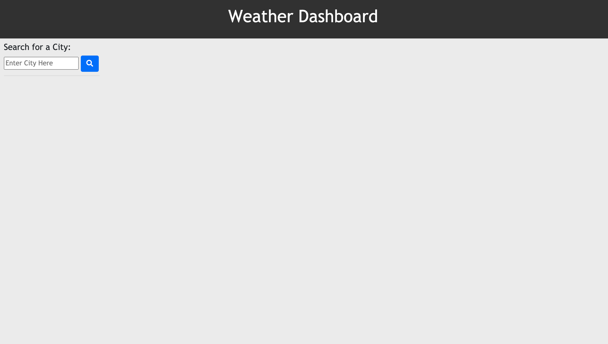
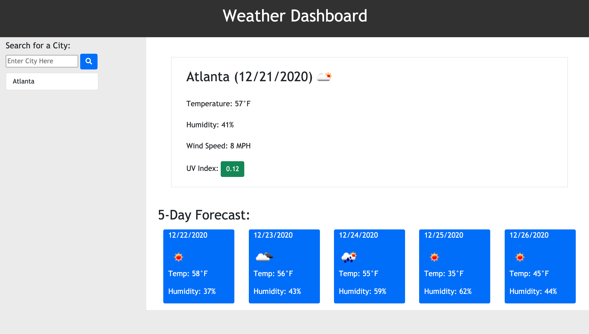

# Weather Dashboard
This webpage was created so that 

# Installation

No installation is necessary. The [deployed website](https://mollymccollumwx.github.io/weather-dashboard/?) features a simple, easy to navigate design. The code for this webpage can be found at [Github](https://github.com/mollymccollumwx/weather-dashboard).

# Usage
The user is greeted to the webpage by a mostly blank page with a search bar in the left top corner. 

Once the user types in a city and presses the search button, page displays the user-selected city's current conditions and 5 day forecast. 

All of the recently searched cities appear under the search bar on the left side of the screen. At anytime the user can click on of those cities to get the forecast to display. The information persists between page refreshes. 

# Credits
This webpage was created while enrolled at the Georgia Tech Coding Bootcamp. Contributors include TAs and tutors who helped debug the code.

# License 

MIT License

Copyright (c) [2020] [Molly M]

Permission is hereby granted, free of charge, to any person obtaining a copy of this software and associated documentation files (the "Software"), to deal in the Software without restriction, including without limitation the rights to use, copy, modify, merge, publish, distribute, sublicense, and/or sell copies of the Software, and to permit persons to whom the Software is furnished to do so, subject to the following conditions:

The above copyright notice and this permission notice shall be included in all copies or substantial portions of the Software.

THE SOFTWARE IS PROVIDED "AS IS", WITHOUT WARRANTY OF ANY KIND, EXPRESS OR IMPLIED, INCLUDING BUT NOT LIMITED TO THE WARRANTIES OF MERCHANTABILITY, FITNESS FOR A PARTICULAR PURPOSE AND NONINFRINGEMENT. IN NO EVENT SHALL THE AUTHORS OR COPYRIGHT HOLDERS BE LIABLE FOR ANY CLAIM, DAMAGES OR OTHER LIABILITY, WHETHER IN AN ACTION OF CONTRACT, TORT OR OTHERWISE, ARISING FROM, OUT OF OR IN CONNECTION WITH THE SOFTWARE OR THE USE OR OTHER DEALINGS IN THE SOFTWARE.